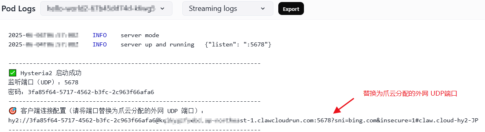

# Claw Cloud 部署 Hysteria2 Docker 镜像


## ➡️Claw.Cloud官网(GitHub注册送5美元地址)：[run.claw.cloud](https://console.run.claw.cloud/signin?link=M9P7GXP3M3W5)

这是一个用于部署 [Hysteria2 ](https://github.com/vipmc838/claw-hy2)的轻量级代理服务器 Docker 镜像 ，用于通过爪云（ClawCloud）服务进行外网连接。该镜像自动安装并配置 Hysteria2，支持自定义内网端口、外网域名和连接密码。
---
## 📦 项目版本说明
- Hysteria2版本 ➡️[Hysteria2](https://github.com/vipmc838/claw-hy2)：基于 UDP 的高速代理，支持 TLS 加密与伪装。
- Nezha Agent版本 ➡️[Nezha Agent](https://github.com/vipmc838/claw-agent)：哪吒监控客户端，连接至哪吒面板进行主机监控。
- 整合版本 ➡️[Claw HY2 Agent](https://github.com/vipmc838/claw-hy2-agent)：Hysteria2 与 Nezha Agent 的集成版，支持一键部署
---

## 🚀 特性

- 基于 Alpine Linux 构建，体积小巧。
- 支持自签 TLS 证书。
- 自动配置 Hysteria2 服务。
- 支持通过环境变量自定义配置：
- SERVER_DOMAIN：爪云分配的外网域名。
- UDP_PORT：内网监听的 UDP 端口。
- PASSWORD：客户端连接密码（UUID）。
---

## 📦 Docker 镜像

**镜像地址**：[`mc838/claw-hy2`](https://hub.docker.com/r/mc838/claw-hy2)

---

## 🛠️ 环境变量说明

| 环境变量            | 说明            | 示例值                                    |
| --------------- | ------------- | -------------------------------------- |
| `SERVER_DOMAIN` | 爪云分配的外网域名     | `abc.eu-central-1.clawcloudrun.com`    |
| `UDP_PORT`      | 内网监听的 UDP 端口  | `5678`                                 |
| `PASSWORD`      | 客户端连接密码（UUID） | `3fa85f64-5717-4562-b3fc-2c963f66afa6` |

---

## 1. 通过 claw.cloud 部署

1. **Application Name（应用程序名称）**  
   随便填写

2. **Image（镜像地址）**  
```env
mc838/claw-hy2
```

3. **Usage（机器性能配置）**  
   - CPU = 0.1 
   - Memory = 64M

4. **Network（添加网络）**  
   - 网络端口设置：
   - 开启 80 端口 选grpcs://
   - 开启 udp 端口 选udp://
   - 所有端口都选 Public（公网）

5. **Environment Variables（环境变量）**  
```env
SERVER_DOMAIN=abc.eu-central-1.clawcloudrun.com
UDP_PORT=5678
PASSWORD=3fa85f64-5717-4562-b3fc-2c963f66afa6
```

✅ 设置完成后即可点击部署。

6. **Pod List（客户端连接配置）**  

- 在日志中查看节点信息  
- 示例输出如下：




## 免责声明

- 本程序仅供学习了解，非盈利目的，请于下载后 24 小时内删除，不得用作任何商业用途，文字、数据及图片均有所属版权，如转载须注明来源。  
- 使用本程序必须遵守部署服务器所在地、所在国家和用户所在国家的法律法规，程序作者不对使用者任何不当行为负责。


